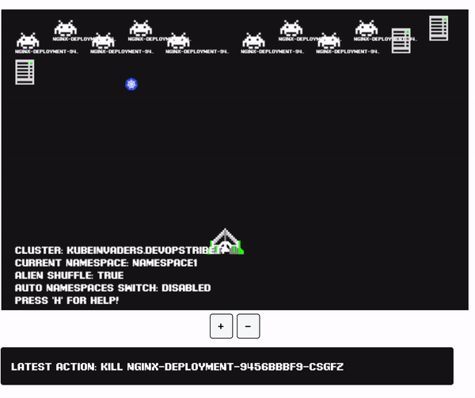

# How to use Kubeinvaders on Minikube

## Prerequisites

- [Minikube](https://github.com/kubernetes/minikube)
- [kubectl](https://kubernetes.io/docs/tasks/tools/)
- [Helm](https://helm.sh/)
- Hypervisor (Parallels, Hyperkit, VirtualBox)

## What we are going to install in our cluster

- Kubeinvasers 1.9.6
- Ingress addons for Minikube
- x1 Deployment, x1 ReplicaSet, x10 nginx pods in namesapce **ns-1**

## Architecture

[TBD]

## Walkthrough

### Setup your Minikube cluster

```make init-cluster```

### Setup Kubeinvaders, Ingress addons and nginx deployment

```make setup-cluster```

### How to reach the applications within the cluster

The two applications can be accessed at the following paths:

- kubeinvaders.local
- nginx.local

However, to reach them, you need to add these two entries to the ```/etc/hosts``` file, associating these DNS names with the output obtained from the "minikube ip" command.

Run 

```minikube ip```

and add the following entries to the ```/etc/hosts``` file:

```
<your_minikube_ip> kubeinvaders.local nginx.local
```

More about minikube ip command [here](https://minikube.sigs.k8s.io/docs/commands/ip/)

Now you can visit the kubeinvaders.local page and have fun!




